# 守護神碑｜AR 單基地防禦遊戲

以臺灣民間傳說包裝的 AR 手機小遊戲：用手機鏡頭掃描真實地面、召喚神碑，在 60 秒內擋下從前方與兩側湧來的萬年龜。

<p align="center">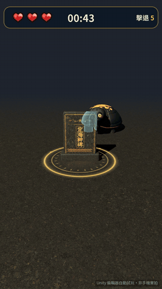</p>

<p align="center"><sub>Unity 編輯器自動試玩錄影（非手機實拍）</sub></p>

| 故事 | 操作說明 | 鎖定與擊退 | 神碑受擊 | 守護成功 | 神碑失守 |
|---|---|---|---|---|---|
|  | 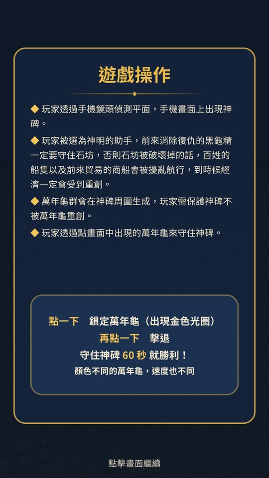 | 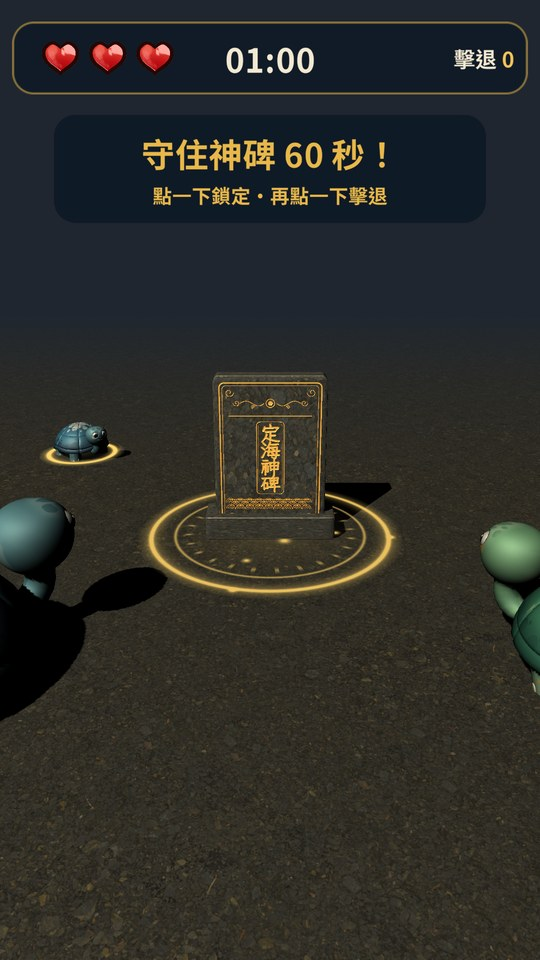 | 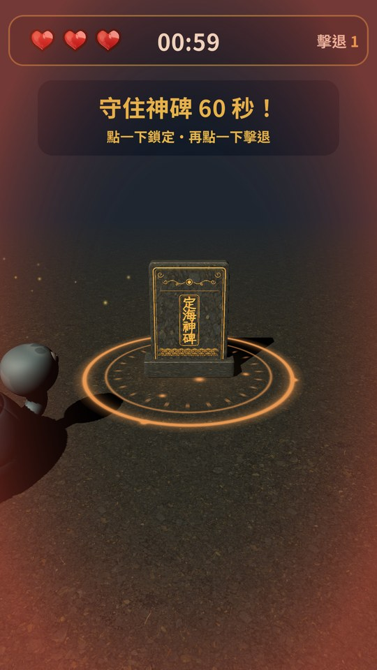 | 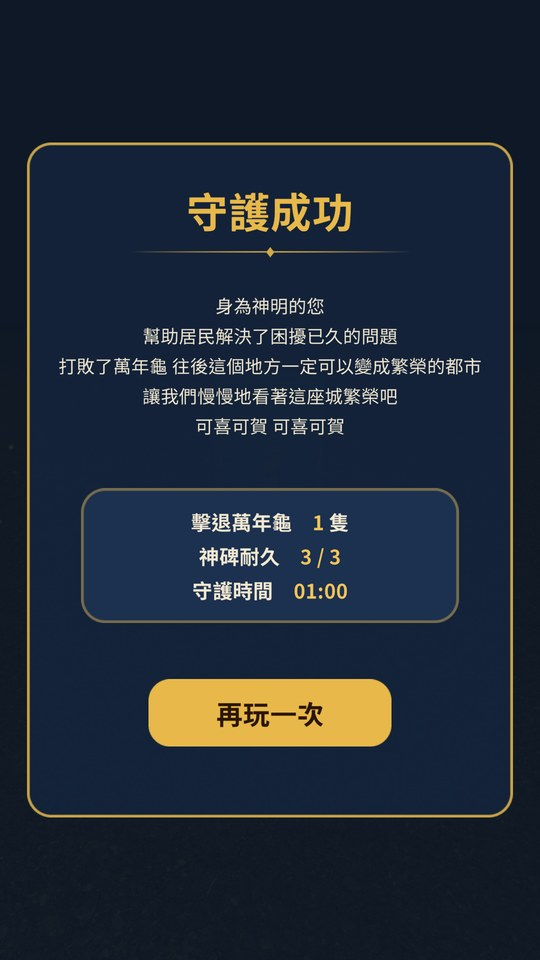 | 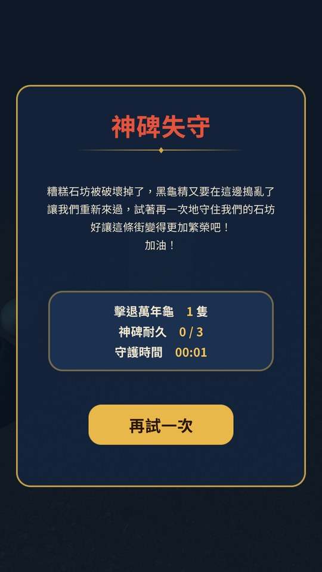 |

| 定海神碑 | 萬年龜步行 | 神碑後方的剪影 | 畫面外的箭頭 |
|---|---|---|---|
| 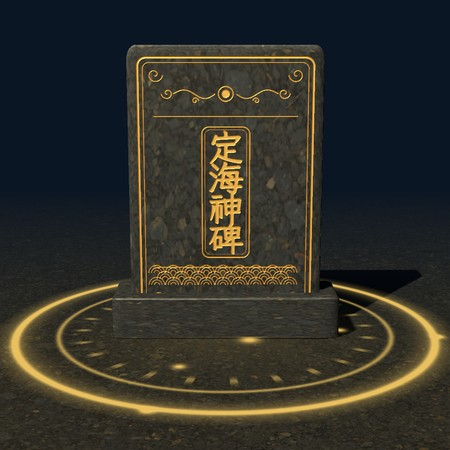 | 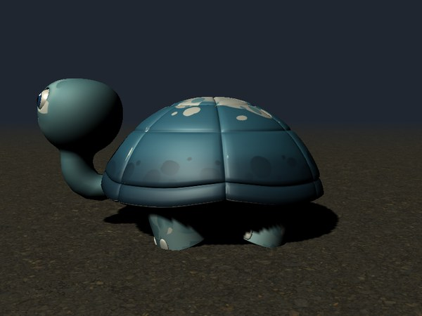 | 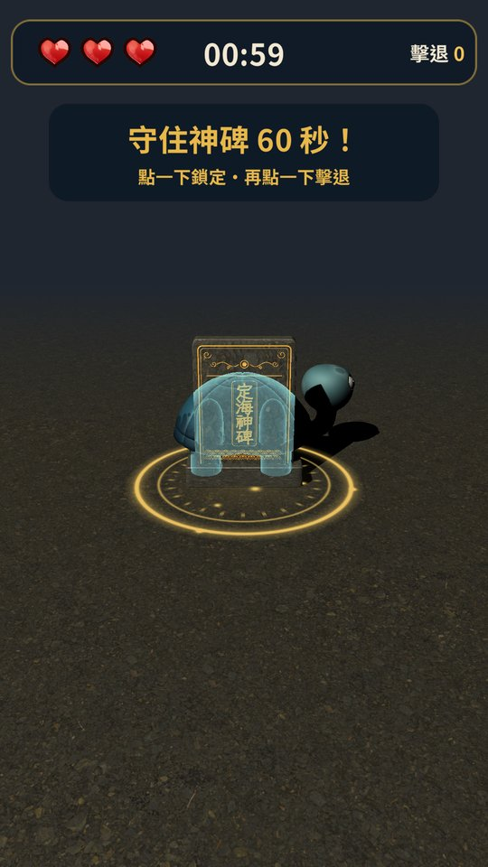 | 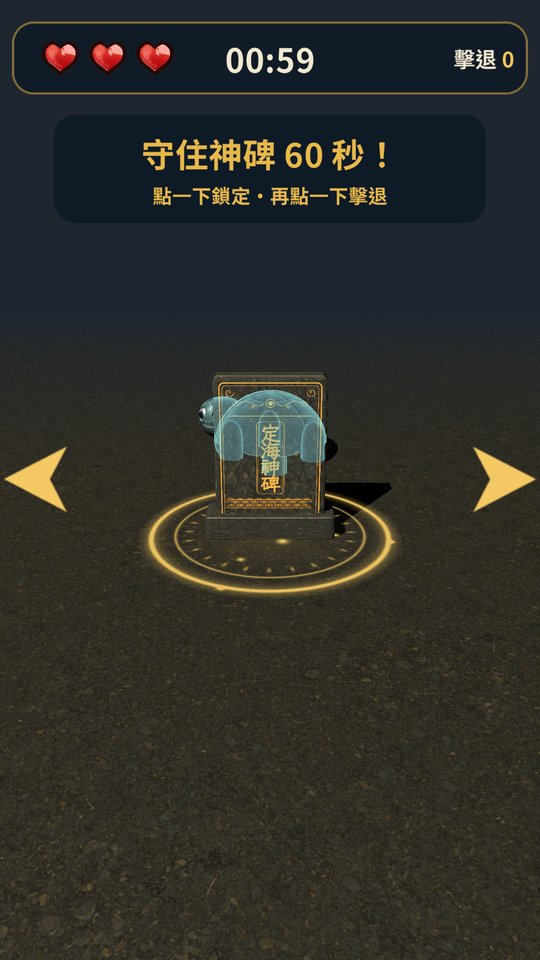 |

## 萬年龜圖鑑

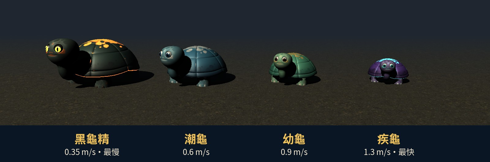

每種萬年龜的顏色、體型與速度都固定，玩家看幾次就記得「這個顏色的走得快」。後面的種類會隨時間解鎖，解鎖後的下一隻必定是新種類，並跳出提示字介紹。

| 種類 | 體型 | 速度 | 出現 | 配色 |
|---|---|---|---|---|
| 幼龜 | 小 | 0.9 m/s | 開局 | 嫩玉綠、柔黃斑 |
| 潮龜 | 中 | 0.6 m/s | 開局 | 深海藍、浪花白斑 |
| 黑龜精 | 大 | 0.35 m/s | 第 12 秒起 | 墨玉黑、發光的餘燼紋、琥珀豎瞳 |
| 疾龜 | 最小 | 1.3 m/s | 第 30 秒起 | 電光紫、發光的青色紋 |

敵人一律走冷色（海、深淵），神碑、結界與介面用暖金，點綴色避開神碑的金與受擊的紅，敵我一眼可分。

## 玩法

1. 看完故事與操作說明後，用手機鏡頭掃描地面。
2. 偵測到平面時，神碑降臨在地面上，腳下展開結界。
3. 萬年龜從神碑後方朝神碑前進：**點一下鎖定**（出現金色光圈），**再點一下擊退**。出生方向以玩家當下的位置為準，坐著玩也看得到；第 21 秒起也會從兩側包抄，但不會出現在玩家背後。
   - 走到神碑後面的萬年龜會透過神碑顯示剪影，點神碑上的剪影一樣點得到；沒點正中時，手指附近最近的一隻也算。
   - 畫面外的萬年龜會在畫面邊緣顯示箭頭，快撞到神碑時箭頭閃爍。
4. 萬年龜碰到神碑就扣 1 點耐久，共 3 點；結界顏色會由金轉紅。撐過 60 秒即守護成功。
5. 越接近結束，生怪間隔越短、每波數量越多；最後 10 秒倒數轉紅並逐秒提示。
6. 結算畫面可以直接再玩一次，神碑留在原地，不用重新掃描。

## 系統設計

```
教學（點擊換頁）→ 掃描地面 → 神碑降臨 → 60 秒防守 → 守護成功／神碑失守 → 再玩一次
```

| 模組 | 負責 |
|---|---|
| `SinglePlacementManager` | 流程控制。監聽 `planesChanged`，教學看完且掃到平面才放神碑，放置後停用平面偵測以省效能；神碑放下時轉向玩家一次、之後不再跟著轉，AR 模式掛 `ARAnchor` 讓神碑與結界跟著真實地板。依經過時間調整生怪間隔與每波數量；生怪方向每一波依玩家位置重新計算（前方扇形，後半場加入兩側），同一波左右交替並互相隔開；勝負結算與再玩一次。 |
| `EnemyController` | 萬年龜。沿平面向量朝神碑前進，`OnTriggerEnter` 回報神碑受擊；首擊選取、再擊擊退，擊退時播放特效與消失動畫。走路動畫是程序化的：四肢對角交替擺動、殼隨步伐起伏、頭跟著點，步伐依實際移動距離推進，大隻的步幅也大；停下時改成張望與呼吸。 |
| `EnemyTapInput` | 點擊判定。射線只找萬年龜、穿過神碑；沒點正中時挑畫面上手指附近最近的一隻；有觸控時不理模擬出來的滑鼠事件。 |
| `OffscreenIndicators` | 畫面外的萬年龜在畫面邊緣顯示箭頭（箭頭圖形由程式產生），快撞到神碑時閃爍。 |
| `UIManager` | 介面。教學面板、掃描提示、HUD（倒數、耐久、擊退數）、開局與最後 10 秒提示字、受擊暈影、結算戰績。 |
| `GameAudio` | 音效與背景音樂；結算時壓低音樂。 |
| `LightFollowCamera` | 主光跟著鏡頭朝向，玩家看到的那一面才不會背光。 |
| 遮擋剪影（`Assets/Art/Shaders/`） | `SteleOcclusionMask` 把神碑看得到的像素寫進 stencil，`OccludedSilhouette` 只在這些像素、而且萬年龜在神碑後面時畫出半透明剪影；選取後剪影轉金色。萬年龜自己的殼擋住腳時不會冒出剪影。 |
| `NonARFallback` | 啟動時檢查 ARCore；不支援或裝不起來就改用模擬場景（虛擬地面＋陀螺儀或拖曳看四周），同一台手機只請 Play 商店安裝一次。 |

主要數值都在 Inspector 上調整：

| 參數 | 預設 | 說明 |
|---|---|---|
| 倒數時間 | 60 秒 | 撐過即勝利 |
| 神碑耐久 | 3 | 等於 HUD 愛心數量 |
| 生怪間隔 | 5 秒 → 3 秒 | 依經過時間線性縮短 |
| 每波數量 | 1–2 隻 → 2–3 隻 | 同上 |
| 生成半徑 | 3.5 公尺 | 室內也放得下 |
| 生怪方向 | 前方 ±8–30°；第 21 秒起加入兩側 ±45–100° | 以「玩家 → 神碑」的延長線為 0°，每一波依玩家位置重新計算，不會出現在玩家背後 |
| 萬年龜速度 | 依種類固定 0.35–1.3 公尺／秒 | 見上方圖鑑；另有整體速度倍率 |
| 萬年龜大小 | prefab 原尺寸 × 0.92–1.08 | 變化小，種類之間的體型差異才看得出來 |

## 專案結構

```
Assets/
  Scenes/Main.unity        唯一的遊戲場景
  Scripts/                 遊戲程式（ARBase.Game 組件）
  Prefabs/                 神碑、萬年龜（Enemies/）、特效（FX/）
  Art/                     模型、材質、shader、UI 貼圖、App 圖示
  Audio/                   音效與背景音樂
  Fonts/                   Noto Sans TC 等字型
  Editor/                  場景整理與出包工具
  Tests/PlayMode/          自動測試與自動試玩錄影
Tools/                     產生 UI 貼圖、音效配樂、圖示、試玩影片的 Python 腳本
Docs/                      README 用的截圖與預覽
```

## 建置與執行

- Unity **2022.3.62f2**，AR Foundation 5.2＋ARCore XR Plugin 5.2
- 目標裝置：Android 7.0（API 24）以上，直式畫面。支援 ARCore 的手機走 AR；不支援的手機會自動改用模擬場景（虛擬地面，轉動手機或手指拖曳看四周），玩法相同
- 開啟 `Assets/Scenes/Main.unity`；編輯器內可用 AR Foundation 的 XR Simulation 試玩
- 出 APK：選單 **Tools › AR Base › Build Android APK**（輸出到 `Builds/`），或用批次模式：

```bash
Unity.exe -batchmode -quit -projectPath . -buildTarget Android -executeMethod BuildTools.BuildAndroidCli -buildOutput Builds/GuardianStele.apk
```

## 自動測試

PlayMode 測試不依賴 AR 裝置，直接驅動遊戲流程：

- `SceneIsWired`：按鈕、特效、音效都有接上；所有介面文字（含執行時組出的戰績與提示字）字型不缺字
- `PlaneFoundDuringIntro_PlacesBaseOnlyAfterIntro`：看教學時掃到平面，要等教學結束才放神碑；神碑底座貼地；開局後教學面板不會再跳出來
- `FullLevelLoop`：選取、擊退、受擊、失守、再玩一次、最後 10 秒、守護成功
- `LaterTypesUnlockWithIntroToast`：後面的種類解鎖後登場並跳出介紹
- `TurtleBehindSteleShowsSilhouetteAndCanBeTapped`：神碑正後方的萬年龜有剪影，點神碑上的位置能選取與擊退；點在旁邊一點點也算
- `SteleFacesPlayerOnceAndStaysPut`：神碑放下時正對玩家，玩家繞一圈神碑不轉也不移動；再玩一次時重新對準
- `SpawnsFollowPlayerAndNeverComeFromBehind`：前半場只從前方扇形出生，後半場加入兩側並跳提示，玩家換位置後方向跟著變，不會出現在玩家背後
- `OffscreenTurtleShowsEdgeArrow`：畫面外的萬年龜在對應的畫面邊緣顯示箭頭，擊退後消失
- `FallbackModeWorksWithoutAR`：不支援 AR 時改用模擬場景，教學看完直接開局

```bash
Unity.exe -batchmode -projectPath . -runTests -testPlatform PlayMode -testResults results.xml
```

加上 `-shotDir <資料夾>` 會在各步驟輸出截圖。自動試玩錄影：

```bash
Unity.exe -batchmode -projectPath . -runTests -testPlatform PlayMode -testFilter DemoRecording -recordDir <資料夾>
python Tools/make_gameplay_video.py <資料夾> gameplay.mp4
```

## 素材

- 字型：[Noto Sans TC](https://fonts.google.com/noto/specimen/Noto+Sans+TC)（SIL Open Font License 1.1）
- UI 貼圖、特效貼圖、音效：`Tools/generate_ui_art.py`、`Tools/generate_audio.py` 程序化生成
- 神碑碑面（「定海神碑」題字、雲紋、海浪紋）：`Tools/generate_stele_art.py` 生成浮雕描金貼圖與法線貼圖，題字字型為 [霞鶩文楷 TC](https://github.com/lxgw/LxgwWenkaiTC)（SIL Open Font License 1.1），直接畫進貼圖
- 萬年龜的殼、頭、眼睛、四肢與腳爪：由原模型依相連區塊拆出（`Assets/Editor/ShowcaseSceneSetup.cs`），供程序化走路動畫與分部位上色；虹膜、瞳孔、高光由程式生成
- 萬年龜配色：`Tools/generate_turtle_skins.py` 取原手繪貼圖的明暗，依各種類的色票重新上色
- 背景音樂：以 MIDI 寫成五聲音階曲（古箏、尺八、太鼓），用 FluidSynth 搭配 [GeneralUser GS](https://schristiancollins.com/generaluser.php) 音色庫演奏

## 限制

- AR 模式需要支援 ARCore 的 Android 手機；其他手機會改用模擬場景，看不到真實環境。iOS 尚未設定。
- 神碑放在第一個偵測到的平面中心，目前沒有手動挑選放置位置的功能。
- 原為大學課堂專題，2026 年重新整理為作品集展示版。
